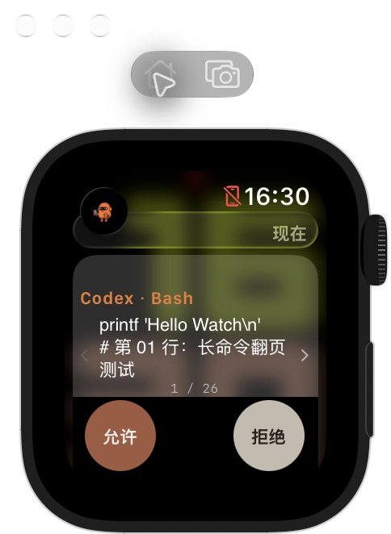
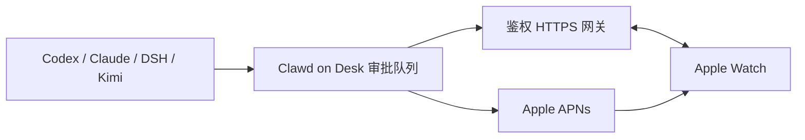

# Clawd Watch Approval

用 Apple Watch 查看并批准 AI coding agent 的操作。Mac 上的 Clawd on Desk 统一接收审批请求，手表通过 HTTPS 直接读取详情并回传“允许一次”或“拒绝”。后台提醒使用 Apple Watch APNs，无需 Pushcut。

Standalone Apple Watch approvals for Codex, Claude Code, DeepSeek Harness and Kimi through Clawd on Desk. Direct HTTPS, device pairing, APNs alerts and interactive notification controls.



## 功能

- Codex、Claude Code、DeepSeek Harness（DSH）、Kimi 审批接入。
- Watch-only App；联网后直接连接 Mac，不依赖 iPhone 作为审批中继。
- App 内审批详情可滚动，允许和拒绝圆按钮固定在底部。
- 抬腕通知可以直接显示命令和审批按钮。长内容点详情区右半边翻到下一页、左半边返回，页码显示阅读进度；允许和拒绝圆按钮分列两侧。系统通知及专注模式设置会影响展示。
- 每台设备独立配对凭据，手表凭据保存在 Keychain；请求有版本和过期时间。
- 决定有 operation ID 和交付回执；响应丢失后查询同一决定，避免重复提交。
- 推送仅带通用提示、请求 ID 和版本；命令详情通过鉴权连接读取。



## 交给你的 coding agent 安装

可以把仓库地址发给自己的 coding agent，让它阅读本 README 并逐步完成安装。无需预先装好桌宠；agent 应先检查现状，再选择下面的路线。

| 当前情况 | 安装路线 |
| --- | --- |
| 没有 Clawd on Desk | 按“准备兼容的桌宠源码”获取固定版本、应用补丁，然后接入用户选用的 agent |
| 已有桌宠，但没配置 agent | 先检查版本及文件是否有修改；使用兼容副本，并按“接入需要的 agent”完成审批连接 |
| 已有桌宠和正常审批 | 检查补丁兼容性，保留原有配置，继续 HTTPS、Watch 签名、APNs 和配对步骤 |

可以直接复制这段请求：

> 请阅读 https://github.com/moonlin1213/clawd-watch-approval 的 README，帮我逐步安装。先只读检查我的 macOS、依赖、现有 Clawd on Desk、正在使用的 agent、Xcode/Apple Developer 和网络配置；缺少必要选择时再问我。只接入我选择的 agent，保留现有 hooks、配置和运行数据；版本不匹配时使用独立兼容副本，不强行覆盖。先验证桌宠能收到真实审批，再配置 HTTPS、Watch 和 APNs。涉及账户登录、协议、开发者后台配置或手表上的授权时，说明具体动作并按所用工具的批准规则交给我操作。私钥只在本机引用，不打印或上传。完成后分别报告哪些步骤已验证、哪些需要我在手表上验收。

agent 可以处理源码、依赖、补丁、测试和构建。用户仍可能需要完成 Apple/Tailscale 登录、Apple 协议及开发者权限确认、手表解锁与通知授权，以及最终的实机观察。没有 Apple Developer/APNs 条件时，应明确说明后台提醒尚未完成，不以模拟器或前台读取代替后台验收。

## 快速开始

需要 macOS、Node.js、Python 3、Git、支持 watchOS 10+ 的 Xcode 和 Apple Watch。实机后台 APNs 需要自己的 Apple Developer 团队、App ID、推送权限和签名配置。此仓库提供源码，没有预签名安装包。

### 1. 准备兼容的桌宠源码

补丁基于 Clawd on Desk 的固定提交；安装器会逐文件核对原始 SHA-256，遇到已有修改或版本不匹配会停止。请先用独立副本验证。

```sh
git clone https://github.com/moonlin1213/clawd-watch-approval.git
cd clawd-watch-approval
git clone https://github.com/rullerzhou-afk/clawd-on-desk.git build/clawd-on-desk
git -C build/clawd-on-desk checkout bf834e7d1f49eb9913702cd38db62bbf8fba8f00
python3 scripts/install-local-patch.py --target build/clawd-on-desk --check
python3 scripts/install-local-patch.py --target build/clawd-on-desk --apply --backup build/desktop-backup
```

桌宠的图像和主题素材从原项目获取，本仓库只提供源码补丁。补丁也包含本版本所需的 DSH/Kimi 接入及回归测试。

```sh
cd build/clawd-on-desk
npm ci
npm start
```

已有桌宠的用户：先记录当前版本、源码修改和启动方式，并保留备份；不要把不匹配的文件强行改到安装器能通过。运行中的桌宠需要在最终切换时停止旧实例，再启动兼容副本，避免两个实例同时写同一份 userData。上述克隆与补丁步骤只准备源码，不会自动替换正在运行的桌宠。

### 1.1 接入需要的 agent

只接入用户实际使用的 agent。本手表审批入口当前支持下面四种；桌宠支持的其他 agent 不会因此自动获得手表审批。

在桌宠 Settings 的 Agents 设置中，启用所选 agent 及其审批气泡；开启全局审批气泡，并关闭会屏蔽审批的桌宠 DND。Codex 的权限模式需要允许拦截真实审批。保留用户原有 hooks，不要重写整个配置文件，也不要启用绕过审批的模式来代替接入。

下列手动 hook 命令在**已应用补丁的桌宠源码目录**执行。正常启动会同步已启用的集成；只有缺失或需要修复时才手动运行。

| Agent | 桌宠接入方式 | 检查点 |
| --- | --- | --- |
| Claude Code | 启动时同步 hooks；必要时运行 `npm run install:claude-hooks` | 确认 Claude Code 已安装并可正常使用，新的权限请求能弹出桌宠审批卡 |
| Codex | 启动时同步 official hooks；必要时运行 `npm run install:codex-hooks` | 确认 hooks 已启用；如果 Codex 提示需要 review，按其提示激活，再验证真实审批 |
| Kimi Code CLI | 启动时同步 hooks；必要时运行 `npm run install:kimi-hooks` | 安装器优先使用已有的 `~/.kimi-code/config.toml`，回退到 `~/.kimi/config.toml`；确认权限请求能弹出审批卡 |
| DeepSeek Harness | 运行 DSH 桌面应用，桌宠自动发现本地服务并连接 | 确认能收到 DSH 的真实审批请求；本集成不向 DSH 安装 hooks |

各 agent 本身未安装或尚未登录时，由用户选择要使用的 agent，再根据对应项目的官方说明完成安装和登录。补充说明见 [桌宠接入指南](desktop-patch/docs/guides/setup-guide.zh-CN.md)；手表支持范围以上表和当前源码为准。

**先验证桌宠审批，再继续手表配置：** 在用户选用的 agent 中发起一条只打印测试文字的命令，确保它确实需要批准。确认桌宠收到对应命令的审批卡，允许后核对命令输出；再用新的测试请求检查拒绝后命令没有执行。仅看到桌宠动画、状态或通知不算审批接入成功。测试也不要给 agent 永久放行权限。

回到本仓库根目录进行后续网络及 Watch 步骤。在桌宠“手表审批”设置中开启服务、填写下一步准备的完整 HTTPS 地址，再生成配对码。网关默认监听 `127.0.0.1:23940`，前缀为 `/api/clawd-watch/v1`。

### 2. 提供 HTTPS 网络入口

可以使用 Tailscale Funnel 或自己的 HTTPS 反向代理。只代理审批网关，不要公开桌宠的 hook 或管理服务。

```sh
bash scripts/configure-clawd-watch-funnel.sh --port 23940
# 阅读预览和已有 Funnel 配置后应用单一路径：
bash scripts/configure-clawd-watch-funnel.sh --apply --port 23940
bash scripts/verify-clawd-watch-boundary.sh https://YOUR-HOST.example
```

如果 Tailscale CLI 不在默认路径，设置 `CLAWD_TAILSCALE_BIN`。脚本不会 reset 已有 Funnel；同路径已有映射时请先核对目标。

### 3. 配置并安装 Watch App

打开 `watch/ClaudeWatch.xcodeproj`，选择 **ClaudeWatchWatch** scheme。此 scheme 是独立 Watch App；保留的上游 iOS 文件不是当前审批中继。

- 在 Watch target 的 Signing & Capabilities 选择自己的开发者团队。
- 将示例 bundle ID `org.example.clawdwatch.watchapp` 改为自己注册的专用 App ID，并开启 Push Notifications。
- 同步修改 `desktop-patch/src/watch-approval-apns.js` 的 `TOPIC`、示例 APNs 配置的 `topic`，以及对应测试中的示例 topic。若已经应用桌宠补丁，也同步修改实际桌宠副本中的该文件。
- `Info.plist` 的审批地址默认留空。可以在手表配对页输入完整地址，例如 `https://YOUR-HOST.example/api/clawd-watch/v1`；也可以自行设置 `ClawdApprovalGatewayURL`。
- 构建安装到自己的手表，然后用桌宠生成的六位临时码配对。

个人团队、服务器地址及签名配置只应保留在自己的本地副本。

### 4. 配置后台提醒

参考 [APNs 配置示例](examples/apns-config.example.json)。Mac 上配置文件的位置是 Electron userData 下的 `watch-approval/apns-config.json`；macOS 通常是 `~/Library/Application Support/clawd-on-desk/watch-approval/apns-config.json`。

用自己的 team ID、key ID、App ID 填写配置，`privateKeyPath` 只引用 Mac 上的 APNs `.p8` 原文件。保护该目录及文件权限（目录 `0700`、配置和密钥 `0600`），重启桌宠以加载配置。不要把私钥放进仓库、App 或手表。

当前 entitlement 示例为开发环境，开发签名注册 sandbox token。App 从签名 profile 读取实际推送环境；生产发布需要相应的生产签名及可用的 APNs 密钥配置。

允许 Clawd Watch 通知，并将它加入当前专注模式的允许列表。要抬腕显示完整通知，关闭系统“轻点显示完整通知”。Mac 必须持续运行且网络入口可达。

## 验证与当前范围

```sh
npm test
swift test --package-path watch/Packages/ClawdWatchCore --scratch-path build/swift-tests
xcodebuild -project watch/ClaudeWatch.xcodeproj -scheme ClaudeWatchWatch -sdk watchsimulator -destination 'generic/platform=watchOS Simulator' -derivedDataPath build/watch-simulator CODE_SIGNING_ALLOWED=NO build
cd build/clawd-on-desk
npm test
```

已在 Apple Watch 实机验证配对、Codex 审批回执、抬腕显示审批按钮和配色；真实 Claude 单次 Bash 测试也成功执行。四种 agent 的完整允许/拒绝矩阵、通知内长内容点按翻页已在 40mm 模拟器系统通知中检查首、中、末页和返回，实机阅读手感及手机关闭后的纯蜂窝全过程仍需分别验收。模拟器截图使用离线样例，不包含真实审批内容。

## 隐私与安全

公开仓库没有运行配置、APNs 密钥、签名证书/profile、设备 token、配对凭据、用户日志或原本地开发历史。开发者团队和服务器地址均为空或示例值。详细边界与报告方式见 [SECURITY.md](SECURITY.md)。

## 上游与许可证

- 桌宠补丁基于 [rullerzhou-afk/clawd-on-desk](https://github.com/rullerzhou-afk/clawd-on-desk)，源码使用 **AGPL-3.0-only**，保留于 [LICENSE](LICENSE)。桌宠素材不在本仓库内，原项目的素材授权不由本仓库重新授予。
- Watch 界面基于 [shobhit99/claude-watch](https://github.com/shobhit99/claude-watch) 的 `037e8b4d5a00e7ebcbfceb03fdd385825fab7fa0`。上游 README 声明 **MIT**；授权及归属见 [watch/LICENSE](watch/LICENSE) 和 [THIRD_PARTY_NOTICES.md](THIRD_PARTY_NOTICES.md)。
- 本仓库新的桌宠接入代码与工具使用 AGPL-3.0-only；Watch 部分使用 MIT。项目不隶属于或代表相关 agent、Apple、Anthropic、OpenAI 或 Tailscale。
